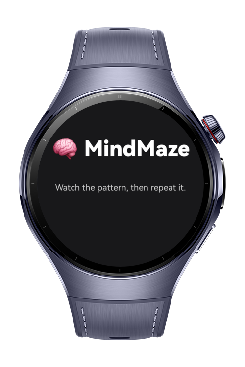
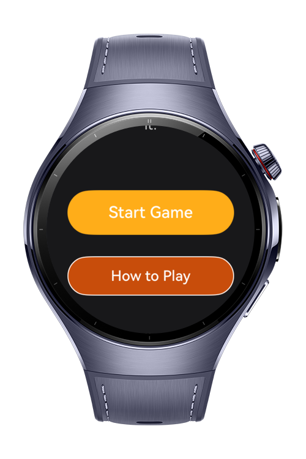
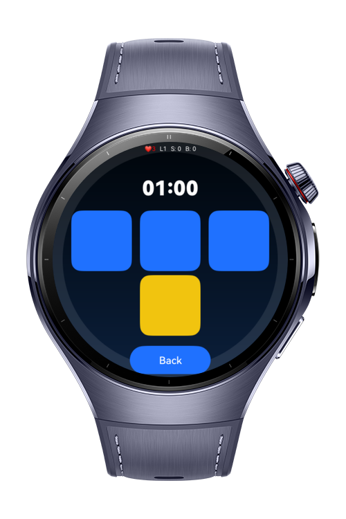

> **Note:** To access all shared projects, get information about environment setup, and view other guides, please visit [Explore-In-HMOS-Wearable Index](https://github.com/Explore-In-HMOS-Wearable/hmos-index).

## MindMaze
A fast-paced memory pattern game built with ArkTS + ArkUI for HarmonyOS wearable devices.

The game shows an increasing tile pattern — you must repeat it in the correct order.  
Each round gets faster. You gain points, lose lives, and chase your best score.

---

### Preview Screenshots

  
  
  

---

### Use Cases
- Pattern memory gameplay for watch form-factor
- Visual feedback and tile flashing
- Haptic feedback (combo / fail)
- Persistent best-score storage
- Touch-based progression — no phone required

---

### Core Mechanics
| Phase        | Meaning                        |
|--------------|--------------------------------|
| Idle         | Waiting on start                |
| Playback     | Tiles flash in sequence         |
| Input        | Player taps tiles               |
| RoundResult  | Round finished (success/fail)   |
| GameOver     | Lives reached 0                 |

---

### Tech Stack

**Language**
- ArkTS

**SDK / Tools**
- HarmonyOS SDK (API 18+ recommended)
- DevEco Studio 5.x

**Libraries / Kits**
- UIAbility / ArkUI
- AppStorage API (light storage)
- Haptic / Vibration API
- Timer / async utilities

---

### Project Directory
|--- entryability
| |--- EntryAbility.ets # app launcher ability

|--- entrybackupability
| |--- EntryBackupAbility.ets # optional backup ability

|--- components
| |--- GameStatusBar.ets # HUD: level / score / lives
| |--- TileButton.ets # tapable tile unit

|--- model
| |--- GameTypes.ets # enums + GameState types

|--- pages
| |--- Index.ets # entry landing view
| |--- HomePage.ets # home / start page
| |--- GamePage.ets # main memory game screen
| |--- GameOver.ets # failure end screen
| |--- ResultPage.ets # round summary

|--- services
| |--- GameService.ets # gameplay mechanics
| |--- HapticService.ets # vibration feedback
| |--- NavigationService.ets # page navigation helper
| |--- StorageService.ets # persistent key-value store

|--- utils
| |--- Delay.ets # async wait helper
| |--- Random.ets # random helpers

|--- viewmodel
| |--- BaseViewModel.ets # shared VM base class
| |--- GameViewModel.ets # main game state machine

---

### Gameplay Flow
Home → Start → Playback → Input → RoundResult → Playback → ... → GameOver

---

### Device Support
- Huawei Watch (HarmonyOS wearable series)
- Recommended: HarmonyOS 5.1.0 / API 18+

---

### License
MindMaze is distributed under the terms of the MIT License.
See the [LICENSE](LICENSE) file for more information.
