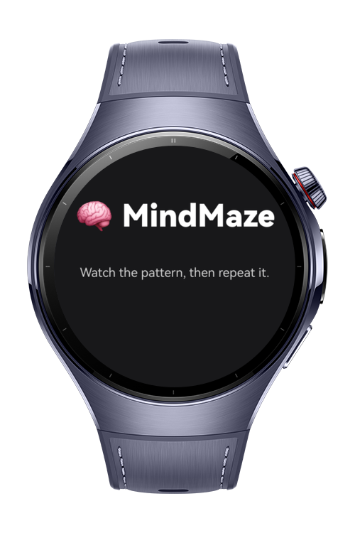
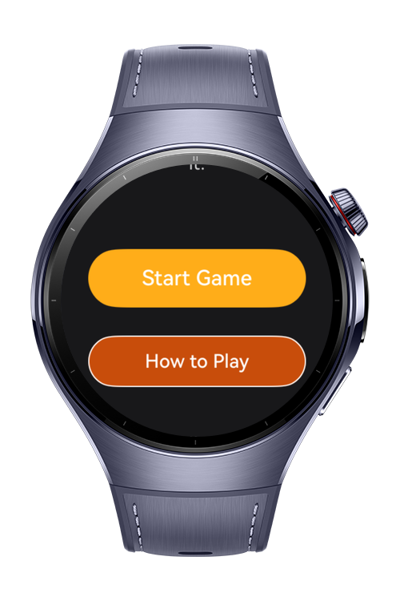
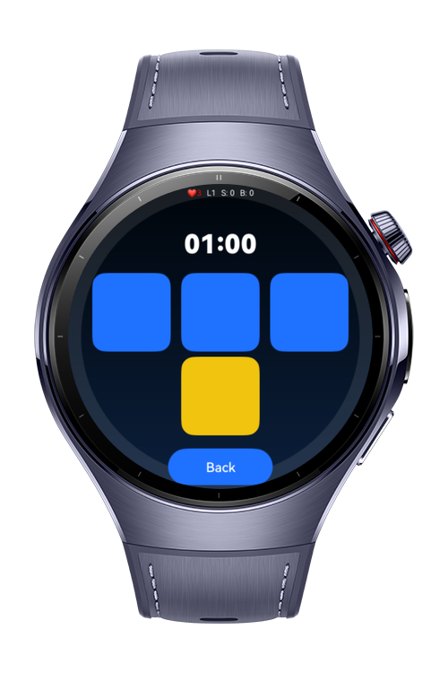

# MindMaze

MindMaze is a fast-paced memory pattern game built with ArkTS + ArkUI for HarmonyOS wearable devices. The game shows an increasing tile pattern — you must repeat it in the correct order. Each round gets faster. You gain
points, lose lives, and chase your best score.

# Preview

<div>
  
  
  
</div>

# Use Cases

- Pattern memory gameplay tailored for watch form-factor
- Visual feedback with tile flashing and progress cues
- Haptic feedback (combo / fail)
- Persistent settings + tutorial state
- Persistent best score, best-by-mode, and recent run summaries
- Touch-based progression — no phone required

# Technology

## Stack (Languages, Frameworks, Tools, Libraries, *3rd Party)

- Languages: ArkTS
- Framework/UI: ArkUI (HarmonyOS), UIAbility
- SDK/Tools: HarmonyOS SDK (6.0.0 / API 20+ recommended), DevEco Studio 6.x
- Libraries/Kits: AppStorage + PersistentStorage, Haptic/Vibration API, Timer/async utilities
- Build/Run: DevEco Studio Simulator; deploy on Huawei Watch 5

## Required Permissions

- Vibration/haptic feedback
- Local persistent storage for tutorial state, settings, best scores, and recent runs
- No network permissions required

## Diagrams - Process

- App Flow: Home → Tutorial / Settings / History / Start → Gameplay → Result

| Phase       | Meaning                       |
|-------------|-------------------------------|
| Idle        | Waiting on start              |
| Playback    | Tiles flash in sequence       |
| Input       | Player taps tiles             |
| RoundResult | Round finished (success/fail) |
| GameOver    | Lives reached 0               |

# Directory Structure

```
entryability/
  EntryAbility.ets           # app launcher ability

entrybackupability/
  EntryBackupAbility.ets     # optional backup ability

model/
  AppDataTypes.ets           # settings, modes, and run-summary models

pages/
  Index.ets                  # entry landing view
  HomePage.ets               # home / start page + compact history summary
  GamePage.ets               # main memory game screen
  ResultPage.ets             # round summary + run breakdown
  TutorialPage.ets           # first-run how-to-play flow
  SettingsPage.ets           # mode and comfort options
  HistoryPage.ets            # recent runs and best-by-mode view

services/
  HapticService.ets          # vibration feedback
  NavigationService.ets      # page navigation helper
  AppDataService.ets         # persistent app-data service

utils/
  Random.ets                 # random helpers

viewmodel/
  BaseViewModel.ets          # shared VM base class
```

# Constraints and Restrictions

## Supported Devices

- Huawei Watch 5
- DevEco Studio Simulator
- OS/API: HarmonyOS 6.0.0+ (API 20+ recommended)
- Performance: Optimized for watch-grade CPUs/GPUs (light animations/timers)
- UX: Small-screen UI; touch-only interaction; no phone dependency
- Data: Local tutorial/settings/history persistence only; no network access

# License (MIT)

MindMaze is distributed under the terms of the MIT License. See the [LICENSE](LICENSE) for more information.